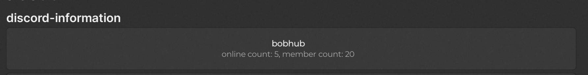

## 07/07/2025

### Forsaken | [Click to here game](https://www.roblox.com/games/18687417158) (Developer: notzanocoddz)

## UI Library: [Fluent-Renewed](https://github.com/ActualMasterOogway/Fluent-Renewed)

__Features:__

#### about tabs
- add discord-information paragraph: (show image)

- add copy-discord-server button
- add credits paragraph

#### player tabs
- added sprint-slider ( set: 1, min: 0, max: 10 )
- added sprint-enable
- added inf-stamina

#### auto tabs
- added solve-delay ( set: 0.3, min: 0.3, max: 0.5 )
- added auto-solve-generator
- added item-spawned ( notifiter )

#### anti tabs
- added disable-cam-shaker

#### visuals tabs
- added generator-esp
- added item-esp
- added survivor-esp
- added killer-esp
- added field-of-view-slider
- added full-bright